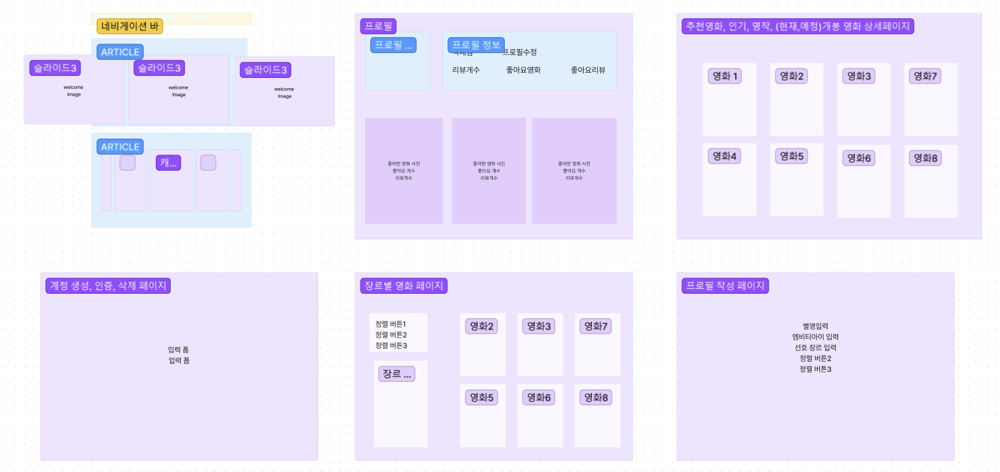

## project - 알고리즘을 활용한 영화 추천 서비스

---

### 1. 서비스 기획 의도

​	현재 대부분의 영화 추천 서비스는 일반적인 기준에 따라 추천되는 영화를 제공합니다. 

​	하지만 개인의 취향과 관심사는 다양하며, 이에 따라 선호하는 영화 장르나 스타일도 달라집니다. 저희는 최근 사람들 사이에서 화제가 되는 MBTI를 활용해 개인 맞춤형 영화 추천 서비스를 개발하면 좋겠다고 생각했습니다.

### 3. 팀원 정보 및 업무 분담

- 김태헌(조장) : 백엔드 모델 구축, 영화 추천 로직 구현, 오류 수정, 웹 페이지 API 요청 코드 작성 및
- 권아진 : 디자인 구성, 리드미작성, 오류 수정

### 4. 목표 서비스 구현 및 실제 구현 정도

- 목표 서비스
  - 인기영화/명작/개봉예정작/현재상영작을 TMDB API요청으로 가져와서 보여주기.
  - DB에서 가져온 데이터로 사용자 MBTI와 나이,취향을 고려해 영화를 추천.
  - 우리 사이트에서 인기 있는 영화, 리뷰가 많이 달린 순으로 영화 보여주기.
- 실제 구현 정도
  - 인기영화/명작/개봉예정작/현재상영작을 TMDB API요청으로 가져와서 보여주기.
  - DB에서 가져온 데이터로 사용자 MBTI와 취향을 고려해 영화를 추천.
  - 우리 사이트에서 인기 있는 영화 추천, 리뷰가 많이 달린 순으로 영화 보여주기.

### 5. ERD


=======
​	

### 6. 초기 웹페이지 레이아웃


### 7. 완성 레이아웃




### 8. 완성된 화면

#### 	8-1. 메인 페이지 (윗 부분)


#### 	메인 페이지 (아랫부분)


#### 8-2. 영화 디테일 페이지 (윗 부분)


=======
#### 영화 디테일 페이지 (아랫부분)

#### 

#### 8-3. 영화 리뷰 상세보기


#### 8-4. 영화 카테고리

.png)

#### 8-5.  프로필 설정으로 MBTI와 취향 파악

.png)

	#### MBTI 작성

.png)

#### 선호 장르 작성

.png)

#### 8-6. 내 프로필 보기

.png)

#### 8-7. 검색 기능

.png)

#### 8-8. MBTI를 기반으로 영화 추천

.png)

#### 8-9. 사용자가 많이 좋아한 영화 순 추천

.png)

#### 8-10. 사용자 취향에 따라 추천

.png)
=======
### 9. 영화 추천 알고리즘에 대한 기술적 설명

- MBTI : 사용자에게 받은 mbti정보와, 미리 만들어 놓은 mbti 별로 추천 할 장르 배열, 영화의 장르 데이터를 비교하여 영화 추천
- 개선할 점 : MBTI별 선호 영화를 빅데이터를 활용해 더 정확한 영화 추천 서비스를 제공하면 좋겠다.

```
// store/index.js
// vuex 
  state{
    MbtiTable: {
      'INFP': ['로맨스', '애니메이션', '코미디', '음악', '가족'],
      'ENFP': ['액션', '모험', '코미디', '로맨스', '판타지'],
      'INFJ': ['드라마', '미스터리', 'SF', '모험'],
      'ENFJ': ['로맨스', '코미디', '가족', '액션', '모험', 'SF', '범죄'],
      'INTP': ['SF', '모험', '미스터리', '역사', '다큐멘터리', '범죄'],
      'ENTP': ['코미디', '공포', '스릴러', '모험', '판타지', 'SF', '범죄'],
      'INTJ': ['미스터리', '범죄', '모험', '판타지', 'SF', '전쟁'],
      'ENTJ': ['스릴러', '범죄', '모험', '판타지', '역사', '액션', '공포'],
      'ISFJ': ['다큐멘터리', '역사', '음악', '미스터리', '가족', '로맨스', '코미디'],
      'ESFJ': ['로맨스', '코미디', '미스터리', '범죄', '가족', '애니메이션'],
      'ISTJ': ['범죄', '미스터리', '다큐멘터리', '역사', '서부', '드라마'],
      'ESTJ': ['역사', '서부', '다큐멘터리', '범죄', '가족', '드라마'],
      'ISFP': ['애니메이션', '판타지', '판타지', 'SF'],
      'ESFP': ['음악', '애니메이션', '액션', '판타지', '코미디', '로맨스', '범죄'],
      'ISTP': ['코미디', '애니메이션', '로맨스', '액션', '미스터리'],
      'ESTP': ['액션', '범죄', '다큐멘터리', '미스터리']
    },
    recommandMbtiMovie: null,
  },
  mutations{
        GET_RECOMMAND_MBTI_MOVIE(state) {
      const mbti = state.MbtiTable[state.userProfile.mbti]
      const mbtiGenre = []
      for (let mbtigenre of mbti) {
        for (let genre of state.genres) {
          if (mbtigenre === genre.name) {
            mbtiGenre.push(genre)
          }
        }
      }
      const recommand = []
      state.popularMovie.forEach((movie) => {
        for (let genre of mbtiGenre) {
          if (movie.genre_ids.includes(genre.id)) {
            recommand.push(movie)
          }
        }
      })
      // console.log(recommand)
      state.recommandMbtiMovie = _.sampleSize(recommand, 50)
    },
  },
  actions{
    saveProfile(context, payload) {
      axios({
        method: 'post',
        url: `${DJANGO_URL}/movies/profile/`,
        data: {
          nickname: payload.nickname,
          mbti: payload.mbti,
          prefer_genre: payload.prefer_genre
        },
        headers: {
          Authorization: `Token ${context.state.Token}`
        }
      })
        .then((res) => {
          // console.log(res)
          // console.log('성공')
          context.commit('SAVE_PROFILE', res.data)
        })
        .catch((error) => {
          console.log(error)
          // console.log(context.state.selectedPreference)
        })
    },
  }

  //movies/models.py
  // 백엔드 모델
  class Profile(models.Model):
    user = models.ForeignKey(settings.AUTH_USER_MODEL, on_delete=models.CASCADE, blank=True, null=True)
    nickname = models.CharField(max_length=15, blank=True, null=True)
    mbti = models.CharField(max_length=4, blank=True, null=True) #MBTI정보
```

- 취향 : 사용자가 선택한 장르를 가진 영화를 가져와 추천

```
//store/index.js
// vuex
state{
    preferenceGenre: null,
    selectedPreference: [],
    totalUserPreferGenre: null,
    userPreferGenre: null,
},
mutations{
      // 선택 안 한 장르
    GET_PREFERENCE_GENRE(state) {
      if (state.preferenceGenre === null) {
        state.preferenceGenre = state.genres
      }
    },
    // 선택한 장르
    SELECTED_PREFERENCE_GENRE(state, seletedGenre) {
      state.preferenceGenre = state.preferenceGenre.filter((genre) => {
        return !(genre.id === seletedGenre.id)
      })
      const data = {
        id: seletedGenre.id,
        name: seletedGenre.name
      }
      state.selectedPreference.push(data)
    },
    // 장르 선택 취소
    DELETE_SELECTED_GENRE(state, seletedGenre) {
      state.selectedPreference = state.selectedPreference.filter((genre) => {
        return !(genre.id === seletedGenre.id)
      })
      const data = {
        id: seletedGenre.id,
        name: seletedGenre.name
      }
      state.preferenceGenre.push(data)
    },
    // 장르 선택 취소
  SELECT_GENRE_EXIT(state) {
    state.selectedPreference = []
    state.preferenceGenre = state.genres
  },
  // 프로필 정보 저장
  SAVE_PROFILE(state, payload) {
    state.userProfile = payload
    state.selectedPreference = []
    state.preferenceGenre = state.genres
  },
  // 프로필 상세 정보
  GET_PROFILE_DETAIL(state, payload) {
    state.userProfile = payload
  },
  // 선택 장르 저장
  SAVE_USER_PREFER_GENRE(state, payload) {
    state.genres = state.genres.map((genre) => {
      if (genre.id === payload.prefer_genre) {
        genre.userprefergenre_set.push(payload)
      }
      return genre
    })
  },
  // 저장된 선택 장르
  GET_USER_PREFER_GENRE(state, payload) {
    state.totalUserPreferGenre = payload
  },
  // 저장된 선택 안 한 장르
  GET_PREFER_GENRE(state) {
    const preferGenre = state.totalUserPreferGenre.filter((genre) => {
      return genre.user === state.userInfo.id
    })
    const genre = []
    for (let i of preferGenre) {
      for (let j of state.genres) {
        if (i.prefer_genre === j.id) {
          genre.push(j.name)
        }
      }
    }
    state.userPreferGenre = genre
  },
  // 취향 추천 영화
  GET_RECOMMAND_GENRE_MOVIE(state) {
    const myGenreId = state.genres.filter((genre) => {
      return state.userPreferGenre.includes(genre.name)
    })
    const recommand = []
    state.popularMovie.forEach((movie) => {
      for (let genre of myGenreId) {
        if (movie.genre_ids.includes(genre.id)) {
          recommand.push(movie)
        }
      }
    })
    // console.log(recommand)
    state.recommandGenreMovie = _.sampleSize(recommand, 50)
  },
actions{
  saveProfile(context, payload) {
      axios({
        method: 'post',
        url: `${DJANGO_URL}/movies/profile/`,
        data: {
          nickname: payload.nickname,
          mbti: payload.mbti,
          prefer_genre: payload.prefer_genre
        },
        headers: {
          Authorization: `Token ${context.state.Token}`
        }
      })
        .then((res) => {
          // console.log(res)
          // console.log('성공')
          context.commit('SAVE_PROFILE', res.data)
        })
        .catch((error) => {
          console.log(error)
          // console.log(context.state.selectedPreference)
        })
    },
    getUserPreferGenre(context) {
      axios({
        method: 'get',
        url: `${DJANGO_URL}/movies/userprefergenre/`,
      })
        .then((res) => {
          context.commit('GET_USER_PREFER_GENRE', res.data)
        })
    },
    saveUserPreferGenre(context, genres) {
      for (let genre in genres) {
        axios({
          method: 'post',
          url: `${DJANGO_URL}/movies/${genres[genre].id}/userprefergenre/`,
          headers: {
            Authorization: `Token ${context.state.Token}`
          },
        })
          .then((res) => {
            // console.log('성공')
            // console.log(res.data)
            context.commit('SAVE_USER_PREFER_GENRE', res.data)
          })
      }
    },
  }
}

//movies/models.py
// 백엔드 모델
class UserPreferGenre(models.Model):
    user = models.ForeignKey(settings.AUTH_USER_MODEL, on_delete=models.CASCADE, blank=True, null=True)
    prefer_genre = models.ForeignKey(Genre, on_delete=models.CASCADE, default=0)
```

- 뜨거워: 데이터베이스의 영화정보를 돌면서 영화에 달린 좋아요 갯수를 세고, 좋아요를 많이 받은 순서대로 추천

```
store/index.js
state{
    HoTMovie: null,
},
mutaions{
      GETHOTMOVIE(state) {
      let sortedMovie = _.chain(state.popularMovie).sortBy('movielike_count').reverse()
      let cnt = 0
      const arr = []
      for (let movie of sortedMovie) {
        if (cnt >= 20) {
          break
        } else {
          arr.push(movie)
          cnt++
        }
      }
      state.HoTMovie = arr
    },
}


movies/models.py
class MovieLike(models.Model):
    user = models.ForeignKey(settings.AUTH_USER_MODEL, on_delete=models.CASCADE, blank=True, null=True)
    movieLike = models.ForeignKey(Movie, on_delete=models.CASCADE, default=0)


movies/serializers.py
# 영화 좋아요
class MovieLikeSerializer(serializers.ModelSerializer):
    class Meta:
        model = MovieLike
        fields = '__all__'
```

### 10. 느낀점

1.   각자의 역할과 책임을 분명하게 정의하는 것이 프로젝트에서 매우 중요합니다. 
   첫 프로젝트에서는 서로가 담당할 역할과 수행할 작업을 세세하게 정리하지 못했기 때문에, 일의 진행이 원활하지 않았습니다. 
   이 부분은 앞으로의 프로젝트에서는 더욱 신경써서 정의해 나가야 할 것입니다.
2.   프로젝트에서는 의사소통이 매우 중요합니다.  서로가 수행하는 역할과 작업 상황, 문제 등을 상호 공유하고 함께 해결해야 합니다. 
   때로는 의견 충돌이 발생할 수 있는데, 이때는 서로 존중하고 합의를 이루는 것이 중요합니다. 
   저희 프로젝트에서도 git 충돌이 자주 발생했지만, 서로 의사소통을 하면서 문제를 해결할 수 있었습니다. 
     코드 작성이 막히거나 디자인 변경이 필요한 경우도 있었는데, 이때도 서로 소통하면서 문제를 해결했습니다. 이 과정에서 의사소통의 중요성을 크게 깨달았습니다.
3.   프로젝트에서는 업무 일정을 잘 관리해야 합니다. 각자가 맡은 일정을 잘 지키고, 일정이 지연될 경우에는 다른 팀원들에게 미리 알리는 것이 중요합니다. 
     또한, 업무 우선순위를 파악하고, 중요한 일을 우선적으로 처리해야 합니다. 
     프로젝트를 시작할 때는 업무 일정을 세세하게 나누어 관리했지만, 작업이 예상보다 오래 걸려서 계획한 일정을 정확하게 수행하지 못했습니다. 
   이럴 때는 팀원들과 일정을 조율하면서 최대한 프로젝트 기간 내에 완성할 수 있도록 노력했습니다.
